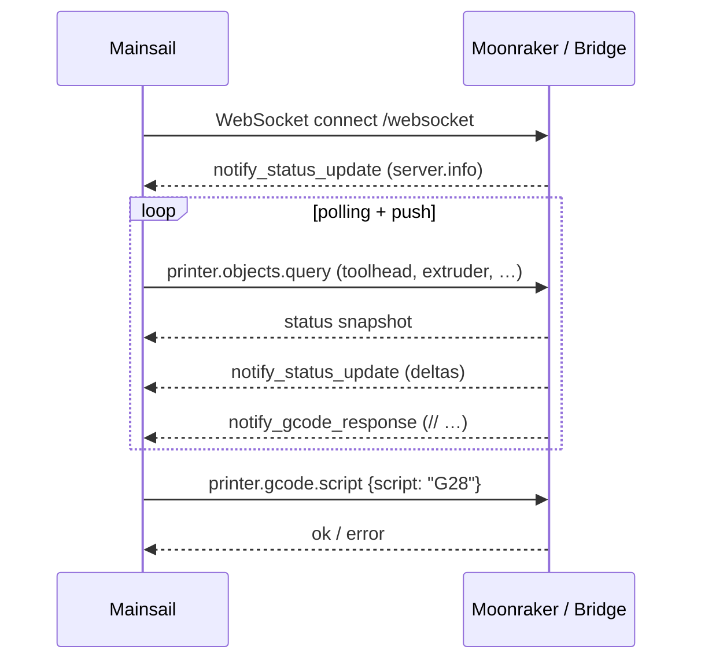
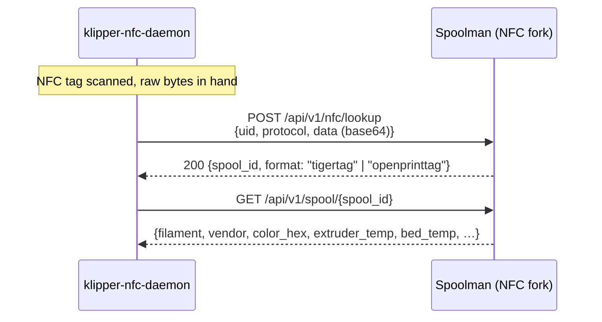
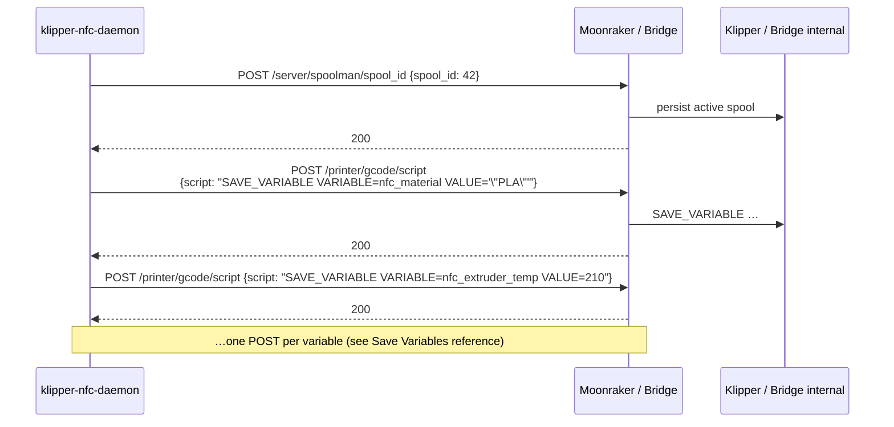
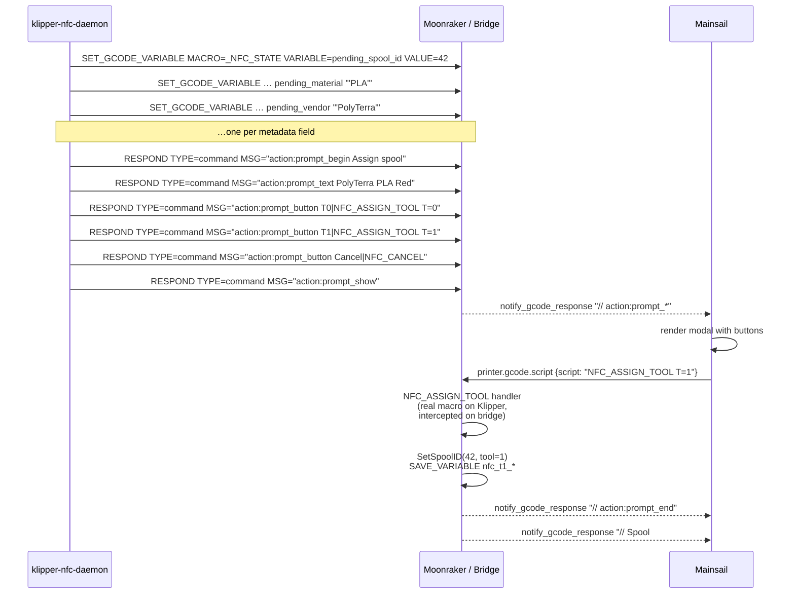
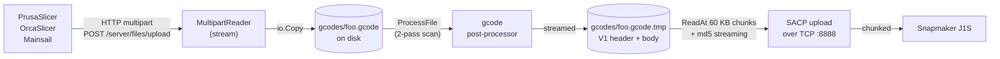
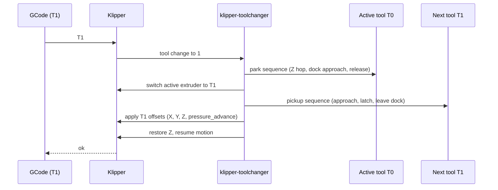

# Data flow

Every cross-process message in the stack, labelled with the actual
protocol and endpoint.

## Mainsail ⇄ host

Identical for real Moonraker and the bridge. The bridge implements the
same JSON-RPC namespace (`printer.objects.query`,
`printer.gcode.script`, `server.files.upload`, etc.) and the same
websocket notification stream.

See [Bridge intercepts](../reference/bridge-intercepts.md) for the
specific gcode commands the bridge handles natively versus passing
through.

## klipper-nfc-daemon ⇄ Spoolman

The lookup endpoint and the env vars (`SPOOLMAN_TIGERTAG_ENABLED`,
`SPOOLMAN_NFC_ENABLED`) live only on the
[`pr/nfc-support`](https://github.com/goeland86/Spoolman/tree/pr/nfc-support)
branch of the fork — see [Spoolman fork](../components/spoolman-nfc.md).

## klipper-nfc-daemon ⇄ host (single-tool mode)

## klipper-nfc-daemon ⇄ host ⇄ UI (multi-tool mode)

The interesting case — the daemon doesn't know which tool the spool
goes on; the operator does. Solved with a Mainsail prompt dialog:

On real Klipper the `NFC_ASSIGN_TOOL` macro lives in `nfc_macros.cfg`
(shipped with the daemon). On the bridge it's
[intercepted natively](../reference/bridge-intercepts.md) — no real
Klipper required.

## J1S upload pipeline (bridge-only)

Pre-v1.6.0 each stage held the entire file in RAM, which OOM-killed the
Pi on 250 MB tile prints. The current pipeline never holds more than a
few KB. See the
[v1.6.0 release notes](https://github.com/goeland86/snapmaker_moonraker/blob/main/Release_Notes.md)
for the gory details.

## Toolchange (StealthChanger, Voron)

The toolchange itself is entirely upstream — see
[viesturz/klipper-toolchanger](https://github.com/viesturz/klipper-toolchanger).
What's stack-specific is that the NFC-loaded per-tool metadata
(`nfc_t{N}_extruder_temp`, `nfc_t{N}_pressure_advance`, etc.) feeds the
toolchange macros — see [Toolchange workflow](../workflows/toolchange.md).
