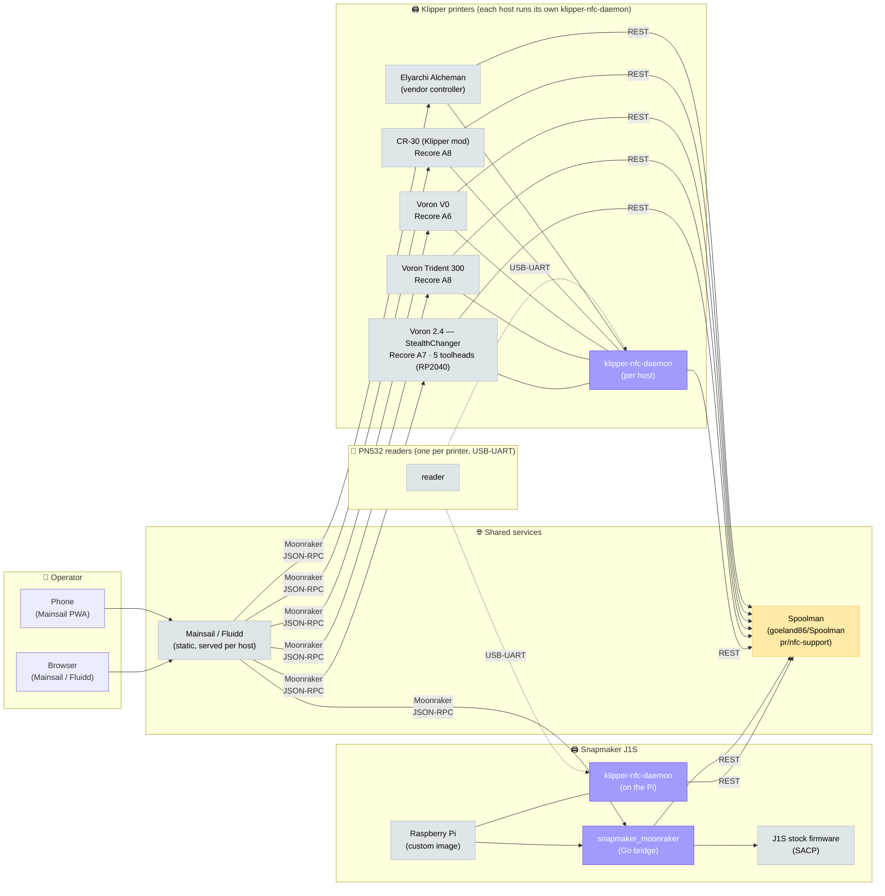
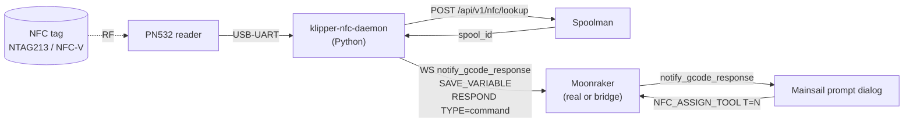

# Fleet overview

A mix of Klipper printers and one Snapmaker J1S pretending to be one
from the operator's perspective. The shared layer is everything above
the printer's TCP socket: Mainsail UI, NFC spool selection, Spoolman
tracking, and consistent `save_variables` for print-start macros.

## Block diagram

**Legend**

**Vanilla** — upstream, unmodified

**Fork** — patched, see [Repo map](repo-map.md)

**Custom** — written from scratch in this stack

## The fleet, side by side

| Aspect | Klipper printers (Voron 2.4 / Trident / V0 / CR-30 / Alcheman) | Snapmaker J1S |
|--------|----------------------------------------------------------------|---------------|
| **Firmware** | Klipper (upstream) | Snapmaker stock — proprietary, SACP over TCP |
| **Host** | Recore A6/A7/A8 (Vorons) or operator's host of choice (CR-30, Alcheman) | Raspberry Pi 3 with the [custom image](../how-to/build-j1s-image.md) |
| **Klipper-side API** | Real Moonraker | [`snapmaker_moonraker`](../components/snapmaker-bridge.md) bridge (Go) on :7125 |
| **Toolheads** | 5 (Voron 2.4 / StealthChanger) or 1 (all others) | 2 × built-in extruders |
| **Macros / `[respond]` / `[save_variables]`** | Native (real Klipper) | [Intercepted by bridge](../reference/bridge-intercepts.md) |
| **Mainsail prompt dialogs** | Yes (real `notify_gcode_response`) | Yes (broadcast by bridge from intercepted RESPOND) |
| **NFC reader** | PN532 on USB-UART (one per printer) | PN532 on USB-UART (built into image) |

The point of the bridge is that **from Mainsail's perspective there is no
difference between the J1S and any Klipper printer**. The same macros,
the same `save_variables` queries, the same prompt dialogs work. That's
what makes a single fleet-wide NFC daemon possible.

## Where the NFC stack plugs in

Every printer in the fleet runs an identical `klipper-nfc-daemon`
instance. The daemon doesn't know or care whether it's talking to real
Klipper or the bridge — it speaks Moonraker JSON-RPC + emits Klipper
macros, and the underlying host (real Klipper or bridge) does the right
thing.

The single daemon handles both single-tool ("J1S left extruder")
and multi-tool ("Voron T2") spool assignments — see [NFC spool
selection workflow](../workflows/nfc-spool.md).

## Read next

- [Data flow diagrams](data-flow.md) — every cross-process message labelled
- [Repo map](repo-map.md) — what's upstream, what's a fork, what's
  bespoke, and why
