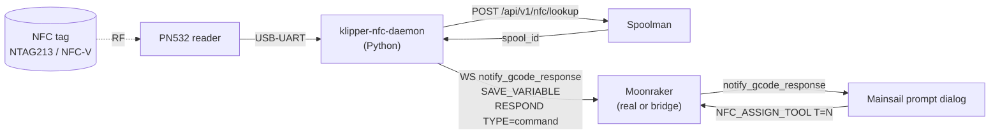

# Fleet overview

The fleet is two printers with very different firmwares pretending to
be the same printer from the operator's perspective. The shared layer
is everything above the printer's TCP socket: Mainsail UI, NFC spool
selection, Spoolman tracking, and consistent `save_variables` for
print-start macros.

## Block diagram

```mermaid
flowchart LR
    subgraph Operator["👤 Operator"]
        Browser["Browser<br/>(Mainsail / Fluidd)"]
        Phone["Phone<br/>(Mainsail PWA)"]
        NFCReader["📇 NFC reader<br/>(per-printer PN532)"]
    end

    subgraph Voron["🖨️ Voron 2.4 — StealthChanger"]
        Recore["Recore A7<br/>Linux host"]
        Klipper["Klipper + klipper-toolchanger"]
        T0["T0…T4<br/>RP2040 toolboards"]
        Recore --> Klipper --> T0
    end

    subgraph J1S["🖨️ Snapmaker J1S"]
        Pi["Raspberry Pi<br/>(custom image)"]
        Bridge["snapmaker_moonraker<br/>(Go bridge)"]
        J1SFw["J1S stock firmware<br/>(SACP)"]
        Pi --> Bridge --> J1SFw
    end

    subgraph Shared["🌐 Shared services"]
        Spoolman["Spoolman<br/>(goeland86/Spoolman<br/>pr/nfc-support)"]
        Mainsail["Mainsail / Fluidd<br/>(static, served per host)"]
    end

    Browser --> Mainsail
    Phone --> Mainsail
    Mainsail -->|"Moonraker<br/>JSON-RPC"| Recore
    Mainsail -->|"Moonraker<br/>JSON-RPC"| Bridge

    NFCReader -.->|USB-UART| Recore
    NFCReader -.->|USB-UART| Pi

    Recore -->|REST| Spoolman
    Bridge -->|REST| Spoolman

    classDef fork fill:#ffeaa7,stroke:#fdcb6e,color:#000
    classDef custom fill:#a29bfe,stroke:#6c5ce7,color:#fff
    classDef vanilla fill:#dfe6e9,stroke:#b2bec3,color:#000

    class Bridge,Spoolman fork
    class Bridge custom
    class Klipper,J1SFw,Recore,Pi,T0,Mainsail vanilla
```

Legend:

- :material-square: **Vanilla** — upstream, unmodified
- :material-square: **Fork** — patched, see [Repo map](repo-map.md)
- :material-square: **Custom** — written from scratch in this stack

## The two printers, side by side

| Aspect | Voron 2.4 (StealthChanger) | Snapmaker J1S |
|--------|----------------------------|---------------|
| **Firmware** | Klipper (upstream) | Snapmaker stock — proprietary, SACP over TCP |
| **Host OS** | Linux on Recore A7 | Raspberry Pi OS Lite (Bookworm 32-bit) on Pi 3 |
| **Klipper-side API** | Real Moonraker | `snapmaker_moonraker` bridge (Go) on :7125 |
| **Toolheads** | 5 × StealthChanger ([viesturz/klipper-toolchanger](https://github.com/viesturz/klipper-toolchanger)) | 2 × built-in extruders |
| **Toolboards** | RP2040 (Kalico-style) | N/A — closed firmware |
| **Macros / `[respond]`** | Native (real Klipper) | Emulated by bridge intercepts |
| **`save_variables`** | Native (real Klipper) | Emulated by bridge against its persistent DB |
| **`SAVE_VARIABLE` / `SET_GCODE_VARIABLE` / `RESPOND TYPE=command MSG="action:prompt_*"`** | Native | [Intercepted by bridge](../reference/bridge-intercepts.md) |
| **Mainsail prompt dialogs** | Yes (real `notify_gcode_response`) | Yes (broadcast by bridge from intercepted RESPOND) |

The point of the bridge is that **from Mainsail's perspective there is no
difference**. The same macros, the same `save_variables` queries, the same
prompt dialogs work. That's what makes the cross-printer NFC daemon
possible.

## Where the NFC stack plugs in

Both printers run an identical `klipper-nfc-daemon` instance. The daemon
doesn't know or care whether it's talking to real Klipper or the bridge —
it speaks Moonraker JSON-RPC + emits Klipper macros, and the underlying
host (real Klipper or bridge) does the right thing.

The single daemon handles both single-tool ("J1S left extruder")
and multi-tool ("Voron T2") spool assignments — see [NFC spool
selection workflow](../workflows/nfc-spool.md).

## Read next

- [Data flow diagrams](data-flow.md) — every cross-process message labelled
- [Repo map](repo-map.md) — what's upstream, what's a fork, what's
  bespoke, and why
