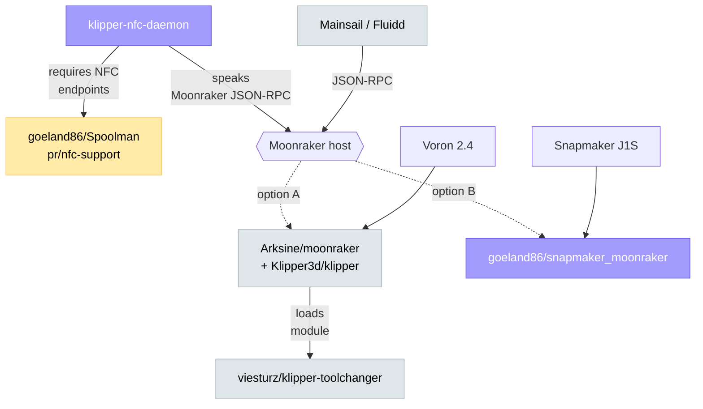

# Repo map

What every repo in the stack does, where it lives, and whether you need
the upstream or a fork.

## Bespoke (written from scratch)

| Repo | Language | Purpose |
|------|----------|---------|
| [**goeland86/snapmaker_moonraker**](https://github.com/goeland86/snapmaker_moonraker) | Go | Moonraker-compatible bridge that turns a Snapmaker J1S into a Klipper-style printer from Mainsail's perspective. Also ships a self-contained Pi 3 SD image build. |
| [**goeland86/klipper-nfc-daemon**](https://github.com/goeland86/klipper-nfc-daemon) | Python | Polls an NFC reader, looks tags up in Spoolman, assigns the spool to the right tool via Moonraker JSON-RPC and Klipper macros. Same daemon works against real Klipper or the bridge. |

## Forks (patched, divergence noted)

| Repo | Upstream | Branch | Why the fork |
|------|----------|--------|--------------|
| [**goeland86/Spoolman**](https://github.com/goeland86/Spoolman) | [Donkie/Spoolman](https://github.com/Donkie/Spoolman) | `pr/nfc-support` | Adds `/api/v1/nfc/lookup` endpoint, `SPOOLMAN_TIGERTAG_ENABLED` and `SPOOLMAN_NFC_ENABLED` env vars. Required by `klipper-nfc-daemon`. Upstream PR pending. |
| [**goeland86/mainsail**](https://github.com/goeland86/mainsail) | [mainsail-crew/mainsail](https://github.com/mainsail-crew/mainsail) | — | Personal-branch tweaks; **not** required by anything else in this stack. The J1S Pi image ships the latest upstream Mainsail release, not this fork. |
| [**goeland86/moonraker**](https://github.com/goeland86/moonraker) | [Arksine/moonraker](https://github.com/Arksine/moonraker) | — | Personal-branch tweaks for non-J1S printers in the fleet. The bridge is a from-scratch Moonraker reimplementation, **not** a fork of this. |

## Upstream (used as-is)

| Repo | Used by | What we use it for |
|------|---------|--------------------|
| [**Klipper3d/klipper**](https://github.com/Klipper3d/klipper) | Every Klipper printer in the fleet | Motion control firmware on MCU + host-side macros. |
| [**Arksine/moonraker**](https://github.com/Arksine/moonraker) | Every Klipper printer | JSON-RPC + websocket API in front of Klipper. |
| [**viesturz/klipper-toolchanger**](https://github.com/viesturz/klipper-toolchanger) | Voron 2.4 (StealthChanger) only | The toolchanger plugin that makes StealthChanger possible. Vanilla — we haven't patched it. |
| [**mainsail-crew/mainsail**](https://github.com/mainsail-crew/mainsail) | Every printer | Web UI. Latest release on the J1S Pi image and on every Klipper host. |
| [**fluidd-core/fluidd**](https://github.com/fluidd-core/fluidd) | Optional | Alternative web UI; works against any host in the fleet. |
| [**mainsail-crew/crowsnest**](https://github.com/mainsail-crew/crowsnest) | J1S Pi image | Webcam streaming. |
| [**KlipperScreen/KlipperScreen**](https://github.com/KlipperScreen/KlipperScreen) | Voron hosts (optional) | Touchscreen UI; the NFC daemon's prompt dialogs render in KlipperScreen too. |

## Dependency graph

## Why we don't fork more

Each fork is a tax — every upstream release needs a re-rebase, every bug
report risks "have you tried vanilla?". The rule of thumb:

> **Fork only when the patch can't reasonably live outside the project.**

That's why:

- The bridge **intercepts** Klipper macros instead of patching Klipper.
- The NFC daemon **calls Moonraker over JSON-RPC** instead of being a
  Moonraker plugin.
- Spoolman is the only mandatory fork in the stack, because the tag
  lookup endpoint is a server-side change that has to live in the
  Spoolman codebase.

When the Spoolman PR merges upstream, that fork goes away too and the
stack becomes "two custom projects + entirely upstream everything else".
