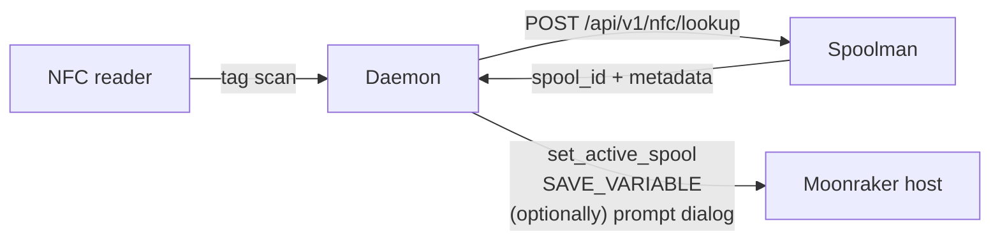

# klipper-nfc-daemon

A Python daemon that turns "tap a tagged spool on a reader" into "the
right tool on the right printer knows what filament is loaded and what
temps to use."

| | |
|---|---|
| **Repo** | [`goeland86/klipper-nfc-daemon`](https://github.com/goeland86/klipper-nfc-daemon) |
| **Language** | Python 3.9+ |
| **Runs as** | `nfc-spoolman.service` systemd unit |
| **Talks to** | a Moonraker host (real or [bridge](snapmaker-bridge.md)) + [Spoolman (NFC fork)](spoolman-nfc.md) |
| **License** | MIT |

## What it does



In **single-tool mode** (default) it silently sets the global active
spool and pushes metadata to `save_variables`. Good for printers with
one extruder.

In **multi-tool mode** it raises a Mainsail prompt asking which tool
the spool just scanned belongs to. Required for StealthChanger /
IDEX / J1S dual-extruder setups.

## Supported NFC readers

| Reader | Bus | TigerTag (NTAG213) | OpenPrintTag (NFC-V) | Notes |
|--------|-----|--------------------|-----------------------|-------|
| **PN532** | UART (via USB-UART) | ✅ | ❌ | Cheapest and most common. Daemon handles HSU wakeup natively — no ESP32 bridge needed. |
| **PN5180** | SPI + 2 GPIO | ✅ | ✅ | Requires `spidev` + `gpiod`/`RPi.GPIO`. |
| **ACR1552U** | USB (PC/SC) | ✅ | ✅ | Requires `pcscd` + `pyscard`. |

See [NFC tag formats](../reference/nfc-tag-formats.md) for what TigerTag
and OpenPrintTag actually contain.

## Configuration

`~/printer_data/config/nfc_spoolman.cfg`:

```ini
[nfc]
reader = pn532                # pn532 | pn5180 | acr1552u
pn532_device = /dev/ttyUSB0
pn532_baudrate = 115200

poll_interval = 0.5
debounce_time = 5.0

mode = multi_tool             # single | multi_tool
tools = 0,1                   # multi_tool: tools to offer in prompt
auto_create = false           # auto-create unknown OpenPrintTag spools
mainsail_preset = true
klipper_variables = true

[spoolman]
url = http://localhost:7912   # or http://your-spoolman-host:7912

[moonraker]
url = http://localhost:7125
```

## What it writes to the printer

### Single-tool mode

| Variable | Type | Example |
|----------|------|---------|
| `nfc_spool_id` | int | `42` |
| `nfc_material` | string | `"PLA"` |
| `nfc_vendor` | string | `"PolyTerra"` |
| `nfc_extruder_temp` | int | `210` |
| `nfc_bed_temp` | int | `60` |
| `nfc_color_hex` | string | `"ff9724"` |
| `nfc_diameter` | float | `1.75` |
| `nfc_filament_name` | string | `"PLA Starter"` |

### Multi-tool mode

Same fields with a `nfc_t{N}_` prefix per tool:

| Variable | Tool 0 example | Tool 2 example |
|----------|----------------|----------------|
| `nfc_t{N}_spool_id` | `42` | `87` |
| `nfc_t{N}_material` | `"PLA"` | `"ASA"` |
| `nfc_t{N}_extruder_temp` | `210` | `260` |
| `nfc_t{N}_bed_temp` | `60` | `100` |
| `nfc_t{N}_vendor` | `"PolyTerra"` | `"eSun"` |
| `nfc_t{N}_pressure_advance` | `0.04` | `0.06` |

See [save_variables reference](../reference/save-variables.md) for the
full schema.

## How it integrates with macros

The fleet's canonical PA-apply macros (`_PA_DEFAULTS` data macro +
`NFC_APPLY_PA` three-tier-priority applier) live in
[save_variables → reading from macros](../reference/save-variables.md#reading-from-macros).
Drop those into `printer.cfg`, call `NFC_APPLY_PA` from `PRINT_START`,
and the daemon's writes Just Work.

The same `printer.save_variables.variables.<name>` access pattern
works on the J1S (talking to the bridge's emulated `save_variables`
object) and on every Klipper printer (talking to real
`[save_variables]`).

## Mainsail preheat preset

When `mainsail_preset = true`, each scan creates/updates a preset named
"NFC: PolyTerra PLA Red" with the spool's temperatures. Single preset
ID is reused so you don't accumulate duplicates.

## Multi-tool flow

See [NFC spool selection workflow](../workflows/nfc-spool.md) for the
full sequence including the prompt-dialog round-trip.

## What it needs from the host

- A Moonraker-compatible HTTP/WS endpoint
- `[respond]` enabled in `printer.cfg` (real Klipper only — the bridge
  has it built in)
- `[save_variables]` configured (real Klipper only — the bridge backs
  this with its persistent DB)
- `nfc_macros.cfg` included from `printer.cfg` (real Klipper only — the
  bridge handles `NFC_ASSIGN_TOOL` / `NFC_CANCEL` natively)

On a J1S running the bridge, **none** of the above need to be configured
— the bridge ships it all built-in.

## Python 3.9 support

PEP 604 `X | None` annotations in the source resolved via
`from __future__ import annotations` (PEP 563), so the daemon runs on
3.9+ hosts without a venv upgrade. Tested in Docker against the
`python:3.9-slim` image.
