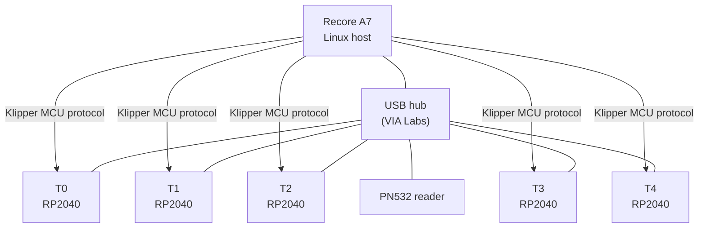

# StealthChanger toolheads

The Voron 2.4 in this fleet runs the
[StealthChanger](https://github.com/CalKraken/StealthChanger) toolchange
mechanism with **5 toolheads** controlled by the
[viesturz/klipper-toolchanger](https://github.com/viesturz/klipper-toolchanger)
Klipper extra.

| | |
|---|---|
| **Platform** | Voron 2.4 |
| **Toolboard** | RP2040-based, one per tool |
| **Host** | [Recore A7](recore.md) |
| **Toolchanger plugin** | [viesturz/klipper-toolchanger](https://github.com/viesturz/klipper-toolchanger) (upstream, unmodified) |
| **NFC reader** | One PN532 (USB-UART) shared across all 5 tools, scanned spools assigned via [multi-tool prompt](../workflows/nfc-spool.md) |

## Topology

## Why this stack

- **klipper-toolchanger** handles the dock/undock kinematics, per-tool
  offsets, and the `T0..T4` GCode contract.
- **NFC daemon's multi-tool mode** populates per-tool `save_variables`
  (`nfc_t0_*` … `nfc_t4_*`) on each spool scan; the print-start macro
  reads those to set temps, PA, and any other per-filament parameters.
- The combination means a tool can be swapped (mechanically or
  spool-wise) and the printer knows what to do without operator
  intervention beyond "tap the spool".

## Known issues / things worth knowing

!!! warning "Toolchange Y clearance"
    Tools currently ram into adjacent docks under some macro variants
    — the `close_y` parameter is too small. Pending fix; increase
    `close_y` per [viesturz/klipper-toolchanger
    docs](https://github.com/viesturz/klipper-toolchanger#configuration)
    when re-tuning the dock positions.

!!! warning "USB enumeration on power cycle"
    The VIA Labs hub has been observed to fail to re-enumerate one of
    the toolboards (`retool1`) after a power cycle. Root cause was
    firmware-version drift between toolboards. Mitigation:
    **flash every RP2040 to the same firmware version in one batch**
    before re-powering the printer. See
    [How-to: flash RP2040 toolheads](../how-to/flash-rp2040.md).

!!! warning "`make flash` on VIA Labs hub"
    The Klipper `make flash` command intermittently fails to write
    through the hub. Use the manual mount-and-copy approach (mount the
    RP2040 as USB mass storage, `cp build/out/klipper.uf2 /mnt/rp2040/`)
    rather than fighting `make flash`. Detailed in the flashing how-to.

## Pressure advance per filament

When a spool is scanned, the NFC daemon writes the spool's tuned
pressure advance from Spoolman into `nfc_t{N}_pressure_advance` (one
key per tool). The fleet's canonical PA-apply macros — `_PA_DEFAULTS`
(data macro of per-material fallbacks) and `NFC_APPLY_PA`
(three-tier-priority applier) — are documented verbatim at
[save_variables → reading from macros](../reference/save-variables.md#reading-from-macros).
That page shows the single-tool form running on the
[Trident](voron-trident.md); on the StealthChanger Voron the same
shape extends to per-tool variants:

- Call `NFC_APPLY_PA` (or a `_T{N}` variant) once per tool inside the
  toolchanger's `POST_TOOL_CHANGE` hook so the picked-up tool's PA is
  set immediately after a swap.
- Seed every tool at the top of `PRINT_START` so first-layer extrusion
  on the initial tool gets the right value.

Spoolman's per-spool nozzle-specific pressure-advance extra (e.g.
`nozzle_0_4_pressure_advance`) stores the tuned value; the daemon
copies it to `save_variables` on every scan so a freshly tuned PA in
Spoolman propagates the moment that spool is loaded.

## Host: Recore A7

See [Recore (A6/A7/A8)](recore.md) — short answer is "Linux SBC with
onboard stepper drivers; runs Klipper natively." Board-specific docs
live on the [iAgent wiki](https://www.iagent.no).
