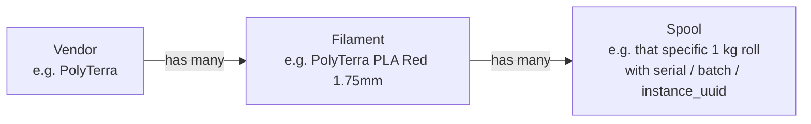

# Manage spool inventory in Spoolman

How the operator keeps Spoolman aligned with the physical spool stock
— from "delivery just arrived" to "spool finished and archived" — so
the [operator workflow](../workflows/operator-workflow.md) always
finds what it expects on a tap.

## The data model in one minute

Spoolman tracks three nested entities:

- **Vendor** — the manufacturer. Created once per brand.
- **Filament** — a specific product SKU: vendor + material + colour +
  diameter + recommended temps. Effectively a "filament profile."
- **Spool** — one physical roll instance. Has its own weight,
  remaining mass, usage history, and (in the NFC fork) the tag-matching
  fields (`external_id` for TigerTag, `extra.instance_uuid` for
  OpenPrintTag).

When the operator taps a tag, the daemon resolves it to a **spool**
(not a filament). That's why each physical roll needs its own spool
entry — otherwise usage tracking falls apart.

## Adding a new spool

### Path A — TigerTag spool (vendor-tagged)

1. **Decode the TigerTag** with the vendor's app or by reading the
   `id_product` from the tag's QR / printed code.
2. **Find or create the filament profile** in Spoolman matching the
   tag's vendor + product:
    - If the filament already exists for this vendor + colour + diameter,
      verify `external_id` is set to the TigerTag's `id_product`.
    - If not, create it. Set:
        - Name (e.g. "PolyTerra PLA — Tropical Red")
        - Material (PLA / PETG / ASA / …)
        - Diameter (typically 1.75)
        - Settings: extruder temp, bed temp
        - **`external_id`** = the TigerTag `id_product`
3. **Create the spool** — Spoolman UI → Spools → Add. Pick the
   filament profile you just verified. Set initial weight (e.g. 1000 g)
   and any batch / lot info you care about.
4. Stick the TigerTag's sticker on the spool if it isn't already on
   it. **No write step needed** — TigerTags are read-only and were
   already encoded by the vendor.

### Path B — OpenPrintTag spool (operator-tagged)

1. **Create the filament profile** if it doesn't already exist
   (same fields as Path A, but `external_id` doesn't matter for
   OpenPrintTag).
2. **Create the spool** in Spoolman.
3. **Write an NFC-V sticker** with the spool's OpenPrintTag payload —
   see [Manage NFC tags → writing](manage-nfc-tags.md#writing-an-openprinttag).
4. **Affix the sticker** to the spool.

Or use the **auto-create shortcut**:

1. Set `auto_create = true` in `nfc_spoolman.cfg` on the printer where
   the tap will happen.
2. Tap a blank NFC-V sticker on the reader.
3. Spoolman creates a placeholder spool with sensible defaults from
   the tag's payload, linked to the tag's UUID.
4. Go back to the Spoolman UI later and fill in the proper filament
   profile, vendor, batch, etc.

Useful when a delivery of pre-tagged "blank" spools arrives and you
just want to get them into the system fast.

## Naming and organisation tips

Spoolman doesn't enforce a naming convention. A consistent one makes
filtering manageable when you have dozens of spools:

| Field | Recommended pattern |
|-------|---------------------|
| **Vendor** | "PolyTerra", "eSun", "Prusament" — exactly as it appears on the spool, no abbreviations |
| **Filament name** | `Vendor` not repeated. Just `Material — Colour` or `Product line — Colour` (e.g. "PLA — Tropical Red", "PolyMax PC — Black"). |
| **Spool ID** | Spoolman assigns these. Don't fight it. |
| **Batch / lot** | Use the `lot_nr` field for the manufacturer batch number — useful when chasing a print-quality issue across multiple spools of the same SKU. |
| **Colour hex** | Set on the filament profile so Mainsail / Fluidd can render a swatch. |

## Tracking remaining material

Spoolman has its own "filament used" math driven by Moonraker's
`server.spoolman.*` integration. The relevant settings are upstream
Spoolman behaviour — outside this site's scope. Two things to know:

- The `klipper-nfc-daemon` only **sets the active spool** in Moonraker
  on a tap. It does not write usage; Moonraker's `[spoolman]` integration
  reports filament consumed per print to Spoolman directly.
- "Remaining weight" decrements automatically once the active spool is
  set on the printer that's about to print.

## Periodic hygiene

| Task | When | How |
|------|------|-----|
| Reconcile stock vs. Spoolman | Monthly, or after a big delivery | Spoolman UI → Filter "remaining > 0" → walk the shelf, check each spool exists in the DB |
| Archive empty spools | Whenever a spool runs out | Spoolman UI → spool → **Archive** (don't delete — usage history is useful). See [Manage NFC tags → tag re-use](manage-nfc-tags.md#re-using-a-tag-from-an-archived-spool). |
| Re-tune PA per filament | After any filament profile change | Run PA tune, update the spool's `extra.nozzle_<size>_pressure_advance`. Next tap pushes the new value to every printer. |
| Backup the database | Weekly (cron) | `pg_dump` (postgres) or `cp spoolman.db` (sqlite). See [Run Spoolman with NFC → backup](run-spoolman-nfc.md#backup). |

## See also

- [Manage NFC tags](manage-nfc-tags.md) — the tag side of inventory
- [Run Spoolman with NFC](run-spoolman-nfc.md) — server-side setup
- [Spoolman fork component page](../components/spoolman-nfc.md) — what the fork adds
