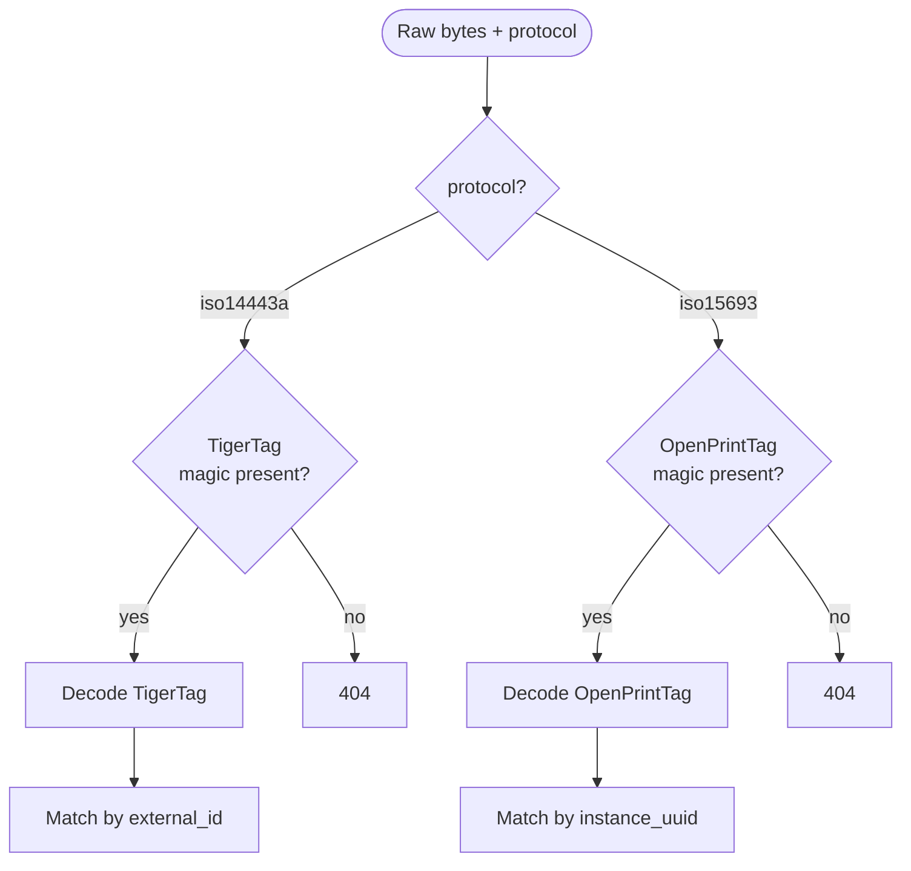

# NFC tag formats

The two tag ecosystems this stack supports, what's in each, and how
they get matched to spools.

## TigerTag (NTAG213, ISO 14443A)

[TigerTag](https://github.com/tiger-tag) is a community/vendor format
on NTAG213 chips (144 bytes of user memory, 13.56 MHz HF, ISO 14443A).
Read by every PN532 / PN5180 / ACR1552U.

### Layout

| Field | Bytes | Notes |
|-------|-------|-------|
| Header / magic | a few | Identifies as TigerTag |
| `id_vendor` | u16 | Manufacturer identifier |
| `id_product` | u16/u32 | Product identifier — matches `filament.external_id` in Spoolman |
| Color | RGB | Display only |
| Diameter | u8/u16 | mm × 100 |
| Length / weight | u32 | Optional, for tracking |
| Print profile hints | varies | Extruder temp, bed temp, etc. |

Exact byte offsets are decoded server-side in the
[Spoolman NFC fork](../components/spoolman-nfc.md) — the daemon
forwards raw bytes verbatim.

### Matching to a spool

The Spoolman fork resolves a TigerTag scan by:

1. Decode `id_product` from the tag bytes
2. Look up `filament` where `external_id = id_product`
3. Return the *first available* `spool` of that filament

### Provisioning a new TigerTag

You don't write to TigerTags from this stack — they're vendor-written
at manufacture time. To use one:

1. Read the printed QR or use the vendor's app to get the `id_product`
2. Create or edit the matching filament in Spoolman, setting
   `external_id` to that value
3. Scan the tag — the daemon now finds the spool

## OpenPrintTag (NFC-V, ISO 15693)

[OpenPrintTag](https://github.com/OpenPrintTag) is a community-defined
format on NFC-V chips (ICODE SLIX2 or similar, up to ~2 KiB). Read by
PN5180 and ACR1552U; **not** by PN532 (PN532 doesn't speak ISO 15693).

### Layout

| Field | Notes |
|-------|-------|
| Magic / version | Identifies as OpenPrintTag |
| `instance_uuid` | UUID derived from the tag's hardware UID |
| Filament metadata | Material, vendor, color, diameter, temps, pressure-advance hints |
| Free space | Operator can stamp additional metadata |

### Matching to a spool

1. Compute `instance_uuid` from the tag's hardware UID
2. Look up `spool` where `extra.instance_uuid = computed_uuid`
3. Return that spool

### Auto-create on first scan

Set `auto_create = true` in `nfc_spoolman.cfg`. On an unrecognized
OpenPrintTag the daemon:

1. POSTs to Spoolman to create a placeholder spool with sensible
   defaults from the tag's payload
2. PATCHes the new spool with `instance_uuid` set to the computed UUID
3. Falls through to the normal assignment flow

The operator then fills in the spool's full details (price, batch,
etc.) in the Spoolman UI later.

### Provisioning a new OpenPrintTag

The daemon doesn't currently write tags — you'd use a separate tool
(e.g. `nfc-tools` or the OpenPrintTag reference writer). On this stack
the auto-create flow above is the recommended path.

## Detecting which format a tag is

The Spoolman fork's `/api/v1/nfc/lookup` endpoint auto-detects:

## Reader/tag compatibility matrix

| Reader | Reads TigerTag | Reads OpenPrintTag |
|--------|----------------|---------------------|
| **PN532** | ✅ | ❌ (no ISO 15693) |
| **PN5180** | ✅ | ✅ |
| **ACR1552U** | ✅ | ✅ |

If your fleet standardizes on TigerTag, PN532 is enough. If you want
both ecosystems on the same reader, use PN5180 or ACR1552U.

## See also

- [klipper-nfc-daemon component page](../components/nfc-daemon.md)
- [Spoolman fork](../components/spoolman-nfc.md)
- [NFC spool workflow](../workflows/nfc-spool.md)
