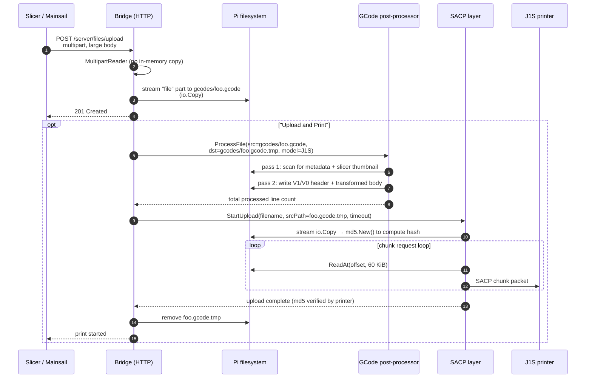

# J1S print upload pipeline

How a GCode file gets from the slicer to the J1S printer through the
bridge — and why every stage of the pipeline streams rather than
buffering.

## Sequence

## Memory profile

| Stage | Pre-v1.6.0 | v1.6.0+ |
|-------|-----------|---------|
| Multipart parse | full body in RAM (`ParseMultipartForm`) | streamed (`MultipartReader`) |
| File save | full body in RAM | `io.Copy` chunked |
| GCode post-process | full body in RAM as `[]byte` | `bufio.Scanner` line-by-line, no full buffer |
| SACP upload prep | full processed body in RAM | `md5.New()` + `ReadAt` from disk |
| SACP chunking | full body in RAM | single 60 KiB chunk buffer |
| **Peak RAM (250 MB tile print)** | **~1.0–1.5 GB** (OOM-kill on 921 MB Pi 3) | **a few MB**, regardless of file size |

## API contracts that changed

The streaming refactor changed several internal Go APIs. If you have
custom code that calls into bridge packages:

| Old | New |
|-----|-----|
| `gcode.Process(data []byte, model string) []byte` | `gcode.ProcessFile(srcPath, dstPath, model string) (uint32, error)` |
| `sacp.StartUpload(conn, filename, gcode []byte, timeout)` | `sacp.StartUpload(conn, filename, srcPath, timeout)` |
| `printer.Client.Upload(filename, data []byte)` | `printer.Client.Upload(filename, srcPath string)` |
| `printer.Client.UploadFile` | (removed — no callers) |
| — | `files.Manager.SaveFromReader(root, filename, src io.Reader)` |
| — | `files.Manager.FilePath(root, filename) string` |
| — | `gcode.CountProcessedLines(srcPath, model) (uint32, error)` |

## Print progress recovery

If the bridge restarts mid-print, it queries the J1S over SACP for the
current print's filename. The bridge then locates that file in
`gcodes/` (recursively, by basename, picking the most-recently-modified
match) and runs `gcode.CountProcessedLines` to recompute the total
line count without re-processing the file. Progress recovery also
fires while paused — a restart during a pause was the diagnostic that
surfaced the original bug.

See [v1.5.1 (now v1.6.0)
notes](https://github.com/goeland86/snapmaker_moonraker/blob/main/Release_Notes.md)
for the bug history.
