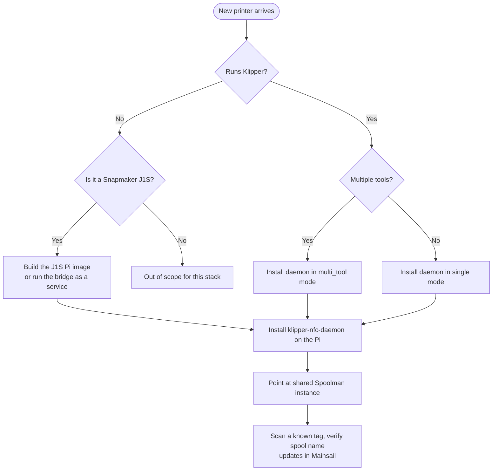

# Bringing up a new printer

Hooking a new printer into the fleet — Voron, CR-30, Alcheman,
J1S, anything Klipper-compatible — so it shares the NFC + Spoolman
flow with the rest.

## Decision tree



## Klipper printer (single-tool)

1. Install Klipper + Moonraker + Mainsail per upstream docs.
2. Add to `printer.cfg`:
   ```ini
   [respond]
   [save_variables]
   filename: ~/printer_data/config/saved_variables.cfg
   [include nfc_macros.cfg]
   ```
3. Add to `moonraker.conf`:
   ```ini
   [spoolman]
   server: http://your-spoolman-host:7912
   sync_rate: 5
   ```
4. Install the [NFC daemon](../how-to/install-nfc-daemon.md). Set
   `mode = single`.
5. Wire up a PN532 over USB-UART (`/dev/ttyUSB0`).
6. Scan a known tag → confirm spool updates in Mainsail's spool panel.

## Klipper printer (multi-tool)

Same as above, plus:

- Set `mode = multi_tool` and `tools = 0,1,…` in `nfc_spoolman.cfg`.
- Make sure the toolchanger plugin
  ([viesturz/klipper-toolchanger](https://github.com/viesturz/klipper-toolchanger))
  is installed and configured.
- Add per-tool reads in `PRINT_START` / `POST_TOOL_CHANGE` macros, see
  [Toolchange workflow](toolchange.md).

## Snapmaker J1S

Option A — turnkey image:

1. [Build the J1S Pi image](../how-to/build-j1s-image.md) (or use a
   pre-built release artifact).
2. Flash to an SD card, boot the Pi, find it on the network.
3. Add the J1S IP + auth token to
   `~/printer_data/config/snapmaker-moonraker.yaml` and restart the
   bridge.
4. Point a browser at `http://<pi-ip>/` — Mainsail comes up against the
   bridge.
5. NFC reader is pre-installed; edit `nfc_spoolman.cfg` to point at
   your Spoolman host if not localhost.

Option B — bridge as a service on an existing host:

1. Cross-compile or `go build` the bridge.
2. Drop it on a Linux host with network reach to the J1S.
3. Configure the printer block in `config.yaml`.
4. Front it with nginx + Mainsail static if you want a web UI on the
   same host.

## Shared Spoolman setup

One Spoolman instance serves every printer in the fleet. Each printer:

- Runs its own `klipper-nfc-daemon` instance.
- Has its own NFC reader.
- Points `[spoolman] url` at the same Spoolman host.

In Spoolman's UI, register each printer; that way usage is tracked
per-printer and the active spool per printer is independent.

## Smoke test

```bash
# On the new printer's host:
nfc-list                                    # reader sees tags
curl http://your-spoolman-host:7912/api/v1/spool | jq length   # >0
curl http://localhost:7125/server/info | jq .   # Moonraker (or bridge) responds
systemctl status nfc-spoolman               # daemon running
journalctl -u nfc-spoolman -f               # tail while scanning a tag
```

Expect, on a tag scan:

```
NFC: detected TigerTag UID=04:12:34:56:78:9A:BC
NFC: matched spool_id=42 (PolyTerra PLA Red)
NFC: assigned spool 42 to active extruder
```

(or, in multi-tool mode, a `prompt_show` line followed by the operator's
button click.)
