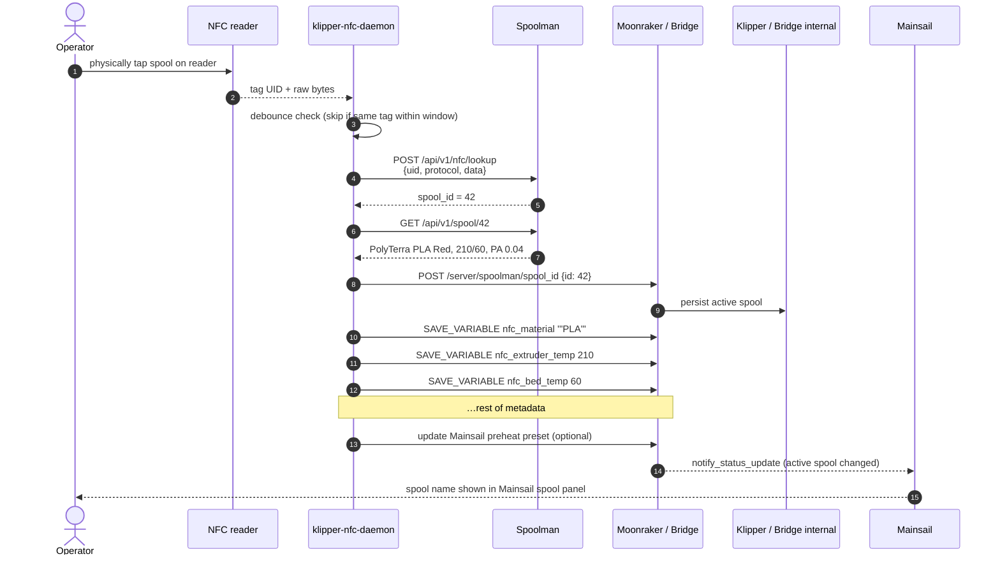
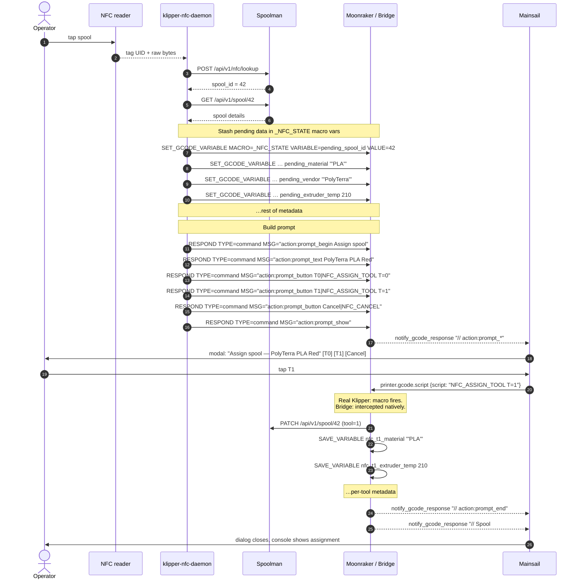

# NFC spool selection

The end-to-end story of "tap a spool, the printer knows what it is."

## Single-tool mode



Operator sees nothing other than the spool name updating in the
Mainsail spool panel and (optionally) a new preheat preset.

## Multi-tool mode

The daemon doesn't know which physical tool the just-scanned spool
belongs to. It asks the operator via a Mainsail prompt dialog:



## Why `_NFC_STATE` exists

The prompt dialog and the assignment command are decoupled — the
daemon broadcasts the prompt and then returns to its poll loop. When
the operator eventually clicks a tool button, the resulting
`NFC_ASSIGN_TOOL` macro/intercept needs to know which spool to assign.

The daemon stashes the pending data in Klipper variables under a fake
macro named `_NFC_STATE`:

```
SET_GCODE_VARIABLE MACRO=_NFC_STATE VARIABLE=pending_spool_id VALUE=42
SET_GCODE_VARIABLE MACRO=_NFC_STATE VARIABLE=pending_material VALUE='"PLA"'
…
```

On real Klipper this needs a stub macro:

```ini
[gcode_macro _NFC_STATE]
variable_pending_spool_id: 0
variable_pending_material: ""
# …etc, in nfc_macros.cfg
gcode:
    # never executed; storage only
```

On the bridge there is no macro — the bridge intercepts every
`SET_GCODE_VARIABLE MACRO=_NFC_STATE …` and stores the field in its
own in-memory `NFCState` (see
[Bridge intercepts](../reference/bridge-intercepts.md)).

## Cancel flow

Clicking **Cancel** sends `NFC_CANCEL` which clears the pending state
and emits `action:prompt_end`:

```
// action:prompt_end
// NFC spool assignment cancelled
```

Same flow on real Klipper (macro) and bridge (intercept).

## Debounce

The daemon's `debounce_time` (default 5 s) suppresses re-trigger from
the same tag UID. Useful because PN532 readers will happily report the
same tag once per poll while a spool sits on the reader.

## What happens if Spoolman is unreachable

The daemon logs an error, skips the rest of the flow, and goes back to
polling. No partial state written to the printer. The operator sees
nothing in Mainsail — they should check `journalctl -u nfc-spoolman -f`.

## What happens if the tag isn't in Spoolman

- **TigerTag (NTAG213)**: no match → logged, ignored. Use Spoolman's
  UI to create a filament profile with the right `external_id`.
- **OpenPrintTag (NFC-V)**: if `auto_create = true`, the daemon
  auto-creates a placeholder spool linked to the tag's UUID and writes
  the lookup back to Spoolman; otherwise same as TigerTag.

## Per-printer reader

Each printer in the fleet has its own NFC reader, each running its own
`nfc-spoolman` daemon, each pointed at the same shared Spoolman
instance. That way assignments are always scoped to the printer the
operator is standing in front of.
