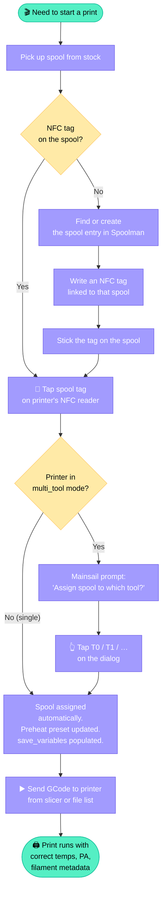
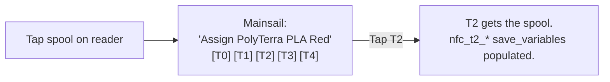

# How the user works with the fleet

This page is the canonical answer to **why this stack exists**. The
forks, the custom daemons, the bridge — all of it serves a single
operator workflow: tap a spool, start a print, and have the printer
know what filament is actually loaded.

## Why these forks exist

The forks and custom projects in this stack each fill a gap that
prevents the workflow below from being achievable with off-the-shelf,
upstream-only tooling.

| Component | Upstream state | What's missing | Why we forked / wrote it |
|-----------|----------------|-----------------|---------------------------|
| **[Spoolman (NFC fork)](../components/spoolman-nfc.md)** | Upstream has no NFC concept — it's a filament inventory DB with REST and a UI, nothing more | No way to map a tag UID + raw bytes to a spool_id | Without server-side tag decoding the workflow falls apart at "what spool is this?". The fork's `/api/v1/nfc/lookup` is the spine of every scan. |
| **[klipper-nfc-daemon](../components/nfc-daemon.md)** | No upstream — Klipper's spool integration assumes the human picks the right spool in Mainsail | Nothing watches an NFC reader, nothing assigns by tap, nothing writes per-tool `save_variables` | The bespoke daemon turns "tap" into a stream of Klipper macros that the operator never has to type. |
| **[snapmaker_moonraker](../components/snapmaker-bridge.md)** | J1S firmware is closed; can't run Klipper on it | No Moonraker on the J1S → no way for Mainsail or the NFC daemon to talk to it | The bridge fakes Moonraker on one side and translates to SACP on the other, so the same operator workflow extends to the J1S unchanged. |
| **Klipper [respond] / save_variables intercepts** (in the bridge) | Upstream Klipper has them natively, J1S firmware doesn't | The multi-tool prompt dialog (`action:prompt_*`) and per-tool persistent metadata both rely on these | Bridge intercepts them so prompt-driven multi-tool flow works on the J1S identically to a real Klipper printer. |

If you could buy this workflow as a single SaaS box, none of these
patches would exist. Until then, the forks are what bridges the
gaps. Once Spoolman's NFC PR merges upstream, that fork goes away too.

## The whole flow

## Step by step

### 1. Pick the spool

Walk to the spool stock shelf, grab whatever filament the print needs.
No software involvement yet.

### 2. Check for an NFC tag

NFC tags in this fleet come in two flavours
([details](../reference/nfc-tag-formats.md)):

- **TigerTag** — a small NTAG213 sticker, usually applied by the
  vendor at manufacture time. Look for the TigerTag QR / sticker on
  the spool's cardboard core or side label.
- **OpenPrintTag** — an NFC-V (ISO 15693) sticker applied by you when
  the spool first enters stock. Looks like a generic round NFC sticker.

If either is present, skip to **step 4**.

### 3. No tag? Add one.

This is the bookkeeping path: register the spool in Spoolman if it
isn't already there, write a tag, stick it on the spool. Detailed
recipe — including how to handle re-used tags from archived empty
spools — lives in:

- [Manage spool inventory in Spoolman](../how-to/manage-spool-inventory.md)
- [Manage NFC tags](../how-to/manage-nfc-tags.md)

One-time per spool. Every subsequent print from this spool is a
single tap.

### 4. Tap the spool on the printer's reader

Each printer in the [reference fleet](../index.md#the-reference-fleet)
has its own PN532 reader, typically mounted somewhere accessible on
the printer chassis or workbench next to it. Hold the spool's tag
against the reader for ~½ second.

What happens behind the scenes (see
[NFC spool selection workflow](nfc-spool.md) for the full sequence):

1. Reader picks up the tag's UID and raw bytes
2. Daemon POSTs to Spoolman's `/api/v1/nfc/lookup`
3. Spoolman matches the tag to a spool and returns its full details
4. Daemon writes per-printer or per-tool `save_variables`

### 5. Multi-tool: pick the tool

On a **single-tool printer** (Trident / V0 / CR-30 / Alcheman /
single-extruder J1S setup) the spool is assigned silently to the
active extruder. You can move on.

On the **StealthChanger Voron 2.4** (multi-tool), a Mainsail prompt
pops up: **"Assign spool — PolyTerra PLA Red"** with buttons
**[T0] [T1] [T2] [T3] [T4] [Cancel]**. Tap whichever tool you've
physically loaded the spool into.

The dialog renders identically on Mainsail (browser/phone) and
KlipperScreen (touchscreen on the printer), so you can pick a tool
from either.

### 6. Start the print

Send the GCode the usual way:

- **From a slicer**: PrusaSlicer / OrcaSlicer / SuperSlicer "Send and
  Print" or "Upload and Print" to the printer's Moonraker endpoint
- **From Mainsail / Fluidd**: pick a file in the file manager, click
  **Print**
- **From the J1S**: the Snapmaker touchscreen also works — the bridge
  picks up touchscreen-initiated prints transparently and the same
  NFC-loaded metadata flows into the print

`PRINT_START` reads the freshly-populated `save_variables` — temps,
pressure advance, per-tool metadata — and the print starts with the
right settings for *this* spool, not whatever the slicer profile
guessed.

## What this buys you

| Without this stack | With this stack |
|-------------------|------------------|
| Keep slicer filament profiles in sync with what's physically loaded | Slicer ignored for filament-specific temps; spool data wins |
| Forget to update PA after tuning a spool → bad first layers | Tuned PA stored on the spool in Spoolman, applied automatically via [`NFC_APPLY_PA`](../reference/save-variables.md#the-canonical-pattern) |
| No idea which spool was used for a print after the fact | Spoolman logs usage per spool, per printer, per tool |
| Mainsail preheat presets stale | Daemon maintains a per-spool preset; one-click preheat for the *current* spool |
| Multi-tool changes require manual updates to slicer per-extruder filament profiles | Per-tool `save_variables` keep each tool's macros honest without operator bookkeeping |

## Common edge cases

| Situation | What to do |
|-----------|-----------|
| Spool ran out mid-print, swap to a fresh one | Tap the new spool on the reader. `save_variables` updates. Resume the print or restart depending on layer state. |
| Wrong tool got the prompt assignment | Tap the same spool again, pick the right tool. |
| Spool not recognized | Check Spoolman is reachable: `curl http://your-spoolman-host:7912/api/v1/spool \| jq length` → returns > 0. Then check the tag's filament `external_id` (TigerTag) or `instance_uuid` (OpenPrintTag) matches what Spoolman has. |
| Prompt never appears in Mainsail (Klipper printer) | `[respond]` is missing from `printer.cfg`. See [Install klipper-nfc-daemon → troubleshooting](../how-to/install-nfc-daemon.md#troubleshooting). |
| Same tag triggers twice in a row | Raise `debounce_time` in `nfc_spoolman.cfg`. |
| Spool emptied — what about its tag? | See [Manage NFC tags → tag re-use](../how-to/manage-nfc-tags.md#re-using-a-tag-from-an-archived-spool). |

## See also

- [Manage spool inventory in Spoolman](../how-to/manage-spool-inventory.md) — the operator-side companion to this page
- [Manage NFC tags](../how-to/manage-nfc-tags.md) — writing, re-using, archiving
- [NFC spool selection workflow](nfc-spool.md) — what the daemon and bridge do during step 4
- [save_variables reference](../reference/save-variables.md) — every key the daemon writes
