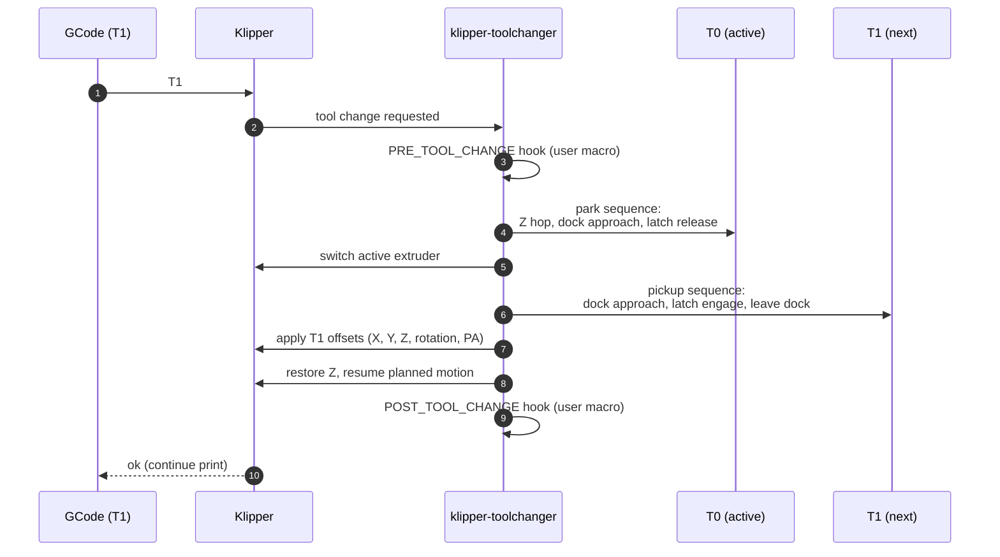

# Toolchange (StealthChanger)

What happens between `T1` in the GCode and the printer extruding from
the new tool, plus how the NFC-loaded metadata flows in.

## The mechanics



The choreography itself is entirely
[viesturz/klipper-toolchanger](https://github.com/viesturz/klipper-toolchanger);
this site doesn't try to re-document it.

## Where NFC metadata enters

Both pre- and post-change hooks read from `save_variables` so per-tool
filament settings travel with the toolchange. The fleet's canonical PA
applier (`NFC_APPLY_PA` + `_PA_DEFAULTS`) is documented verbatim in
[save_variables → reading from macros](../reference/save-variables.md#reading-from-macros).

For a toolchanger the same priority logic (spool-specific PA →
per-material fallback → universal default) applies once per tool. The
shape below extends `NFC_APPLY_PA` to per-tool keys — verify your
extruder naming (`extruder` / `extruder1` / …) matches your config
before using:

!!! info "Adapt to your config"
    The skeleton below uses the same three-tier priority as the
    single-tool `NFC_APPLY_PA`. Pull the per-material defaults from
    `_PA_DEFAULTS` (see [reference](../reference/save-variables.md#reading-from-macros)),
    swap the `nfc_*` reads for `nfc_t{N}_*`, and pass `EXTRUDER=…` to
    `SET_PRESSURE_ADVANCE`. Real macros also need homing checks, error
    paths, and slicer hand-off that aren't shown.

```ini
[gcode_macro NFC_APPLY_PA_TOOL]
description: Apply per-tool PA from NFC scan with material fallback
gcode:
    
    
    
    
    
    

    
        SET_PRESSURE_ADVANCE EXTRUDER={extruder} ADVANCE={pa_stored}
    
         
         
         
         
         
         
         
        
        SET_PRESSURE_ADVANCE EXTRUDER={extruder} ADVANCE={pa_fb}
    
```

Then call it from the toolchange and print-start hooks:

```ini
[gcode_macro POST_TOOL_CHANGE]
gcode:
    
    
    NFC_APPLY_PA_TOOL T={t}

[gcode_macro PRINT_START]
gcode:
    # …homing, levelling, heat soak…
    
        NFC_APPLY_PA_TOOL T={t}
    
    # …prime line, first layer…
```

## What can go wrong, and where the NFC stack helps

| Failure mode | Without NFC | With NFC stack |
|--------------|-------------|----------------|
| Tool 3 is loaded with PETG, you forget to update slicer | Underextrusion / blobs from wrong PA + temp | Last-scanned spool's PA/temp applied automatically; mismatch shows in Mainsail preset name |
| Re-running a print after physically swapping a spool | Slicer-baked temps used (potentially wrong) | If `M109`/`M190` are removed from slicer start gcode and replaced by `nfc_t{N}_*`-driven equivalents in `PRINT_START`, the right temps follow the spool |
| Pressure advance tuned per spool in Spoolman | Operator has to remember to copy values around | Spoolman → daemon → `nfc_t{N}_pressure_advance` → POST_TOOL_CHANGE |

## Known issue: Y clearance on close approach

!!! warning
    With the current dock spacing, the `close_y` clearance in some
    toolchange macro variants is too small — tools can clip adjacent
    docks during the parking approach. Increase `close_y` in the
    toolchanger config until clearance is comfortable, then re-tune
    each tool's dock position. Pending fix in this fleet.
