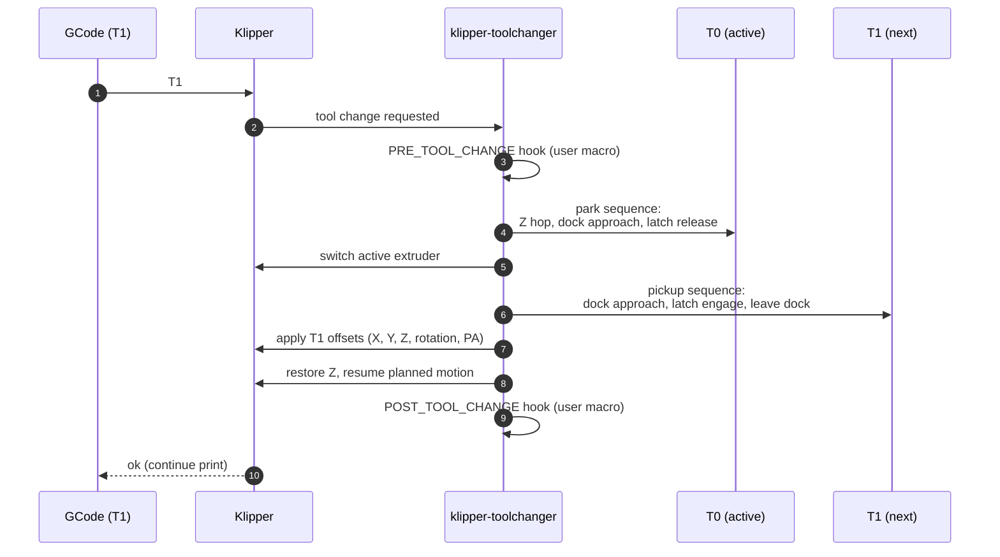

# Toolchange (StealthChanger)

What happens between `T1` in the GCode and the printer extruding from
the new tool, plus how the NFC-loaded metadata flows in.

## The mechanics



The choreography itself is entirely
[viesturz/klipper-toolchanger](https://github.com/viesturz/klipper-toolchanger);
this site doesn't try to re-document it.

## Where NFC metadata enters

Both pre- and post-change hooks read from `save_variables` so per-tool
filament settings travel with the toolchange.

!!! info "The snippets below are examples"
    They illustrate the **pattern**, not a drop-in macro. Real macros
    in this fleet have additional concerns (homing checks, extruder
    naming conventions, slicer hand-off, error recovery) that aren't
    shown here. Adapt to your own `printer.cfg`.

```ini
[gcode_macro POST_TOOL_CHANGE]
description: Apply NFC-loaded per-tool filament settings after a swap
gcode:
    
    
    

    
    SET_PRESSURE_ADVANCE EXTRUDER={printer.toolhead.extruder} ADVANCE={pa}

    
    
        M104 S{t_target} T{t}    ; non-blocking
    
```

The print-start macro does the same at the top, ahead of the first
extrusion, so every tool starts with the right temp/PA:

```ini
[gcode_macro PRINT_START]
gcode:
    
    
        
        
            SET_PRESSURE_ADVANCE EXTRUDER=extruder ADVANCE={pa}
        
            SET_PRESSURE_ADVANCE EXTRUDER=extruder{{ t }} ADVANCE={pa}
        
    
    # …rest of start sequence
```

## What can go wrong, and where the NFC stack helps

| Failure mode | Without NFC | With NFC stack |
|--------------|-------------|----------------|
| Tool 3 is loaded with PETG, you forget to update slicer | Underextrusion / blobs from wrong PA + temp | Last-scanned spool's PA/temp applied automatically; mismatch shows in Mainsail preset name |
| Re-running a print after physically swapping a spool | Slicer-baked temps used (potentially wrong) | If `M109`/`M190` are removed from slicer start gcode and replaced by `nfc_t{N}_*`-driven equivalents in `PRINT_START`, the right temps follow the spool |
| Pressure advance tuned per spool in Spoolman | Operator has to remember to copy values around | Spoolman → daemon → `nfc_t{N}_pressure_advance` → POST_TOOL_CHANGE |

## Known issue: Y clearance on close approach

!!! warning
    With the current dock spacing, the `close_y` clearance in some
    toolchange macro variants is too small — tools can clip adjacent
    docks during the parking approach. Increase `close_y` in the
    toolchanger config until clearance is comfortable, then re-tune
    each tool's dock position. Pending fix in this fleet.
